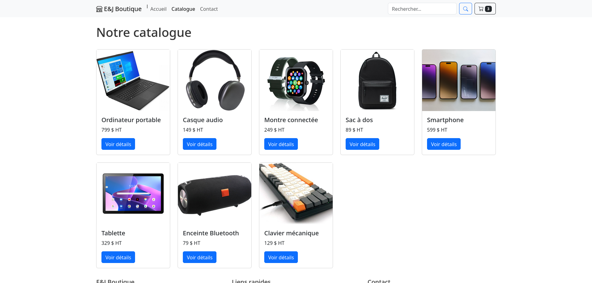
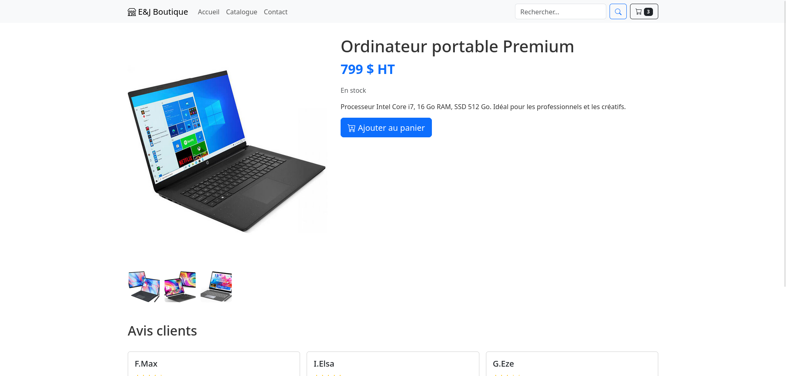
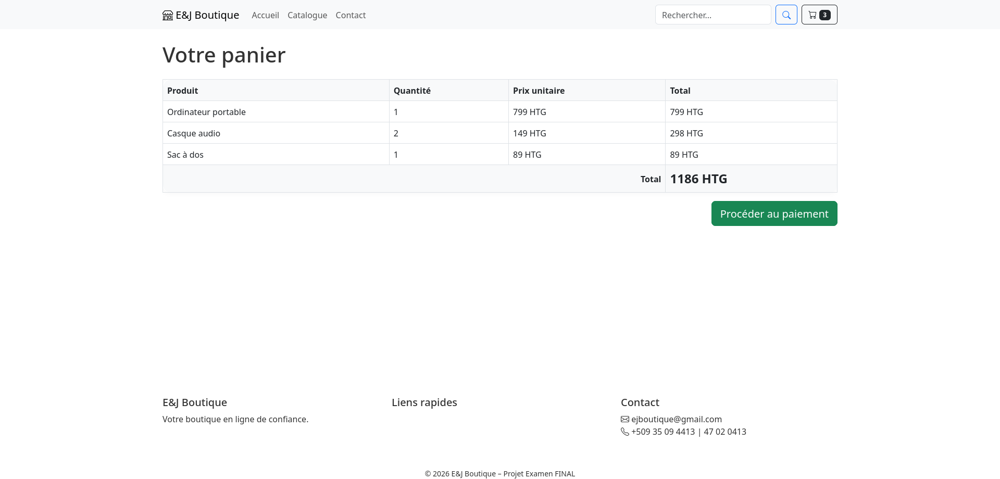
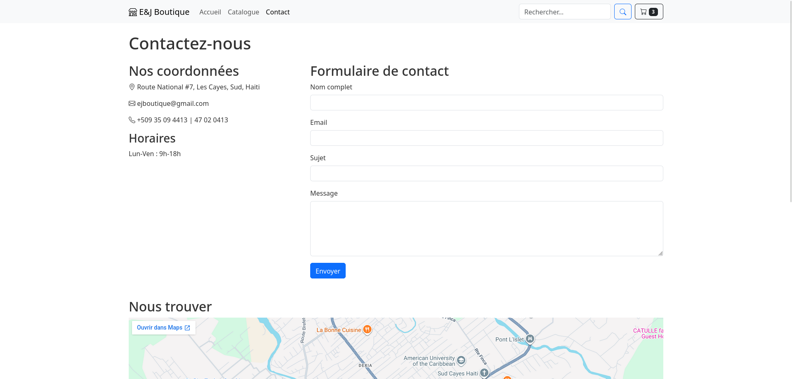

# E&J Boutique - Projet Final UNITECH.

**E&J Boutique** est un site web e-commerce fictif développé dans le cadre du projet final du cours **HTML & CSS, GIT/GitHub & Bootstrap 5** – Session 1, Deuxième Année en Sciences Informatiques à **UNITECH**.  
Ce projet a été réalisé en binôme par **JEAN Crawford-Erill** et **JOSEPH Jorel**.

## 📝 Description

Le site présente une boutique en ligne simple mais quasi complète, avec les pages suivantes :

- **Accueil** : présentation de la boutique, produits vedettes, catégories principales.
- **Catalogue** : grille des produits disponibles.
- **Détail produit** : informations détaillées, galerie d'images, avis clients.
- **Panier** : récapitulatif des articles avec tableau et total.
- **Contact** : coordonnées, formulaire de contact et carte intégrée.

L'objectif était de mettre en pratique les notions apprises durant le cours : structuration HTML, stylisation CSS avancée (flexbox, grid, animations), utilisation du framework **Bootstrap 5** pour la mise en page responsive, et gestion de version avec **Git/GitHub**.

## 🛠️ Technologies utilisées

- **HTML5** – structure sémantique
- **CSS3** – mise en forme personnalisée (fichier `style.css`)
- **Bootstrap 5** – grid, composants, utilitaires responsive
- **Bootstrap Icons** – icônes modernes
- **Google Maps Embed** – intégration de la carte de localisation
- **Git & GitHub** – gestion de version et hébergement du code

## 📸 Aperçu

Quelques captures d'écran du site (à placer dans un dossier `screenshots/`) :

| Page | Aperçu |
|------|--------|
| Accueil |  |
| Catalogue |  |
| Détail produit |  |
| Panier |  |
| Contact |  |


## 🌐 Lien vers le site

Le site est accessible en ligne via **GitHub Pages** :

🔗 [https://ghostcp21.github.io/PROJET-FINAL-UNITECH/E-Commerce/](https://ghostcp21.github.io/PROJET-FINAL-UNITECH/E-Commerce/)


## 🚀 Installation et utilisation en local

1. **Cloner le dépôt**  
   ```bash
   git clone https://github.com/GHOSTCP21/PROJET-FINAL-UNITECH.git
   ```
2. Se rendre dans le dossier du projet  
   ```bash
   cd PROJET-FINAL-UNITECH/E-Commerce
   ```
3. Ouvrir le fichier `index.html` dans un navigateur.

Aucune dépendance supplémentaire n'est requise : Bootstrap et les icônes sont chargés depuis un CDN.

## 👥 Auteurs

- **JEAN Crawford-Erill**
- **JOSEPH Jorel** 

Projet réalisé dans le cadre de la formation **UNITECH**.

---

© 2026 E&J Boutique – Projet Examen FINAL